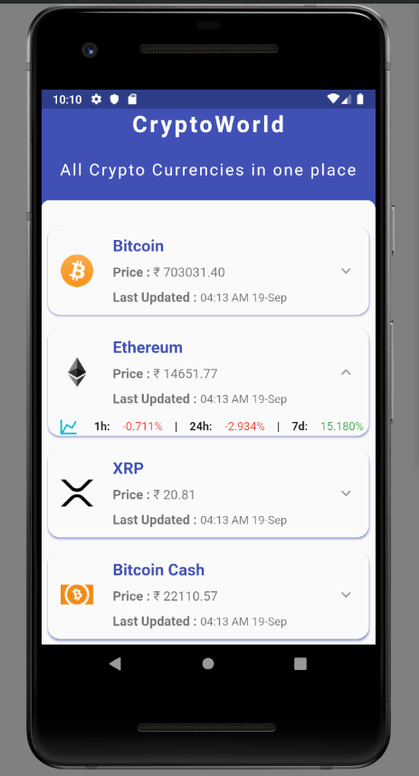
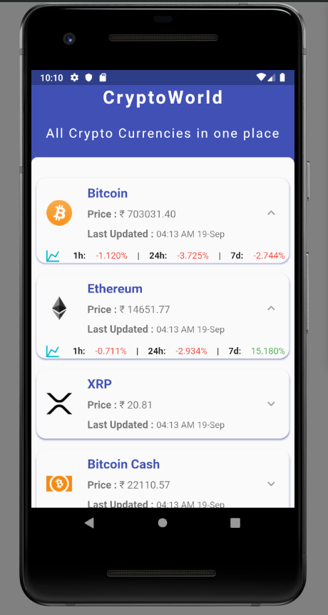
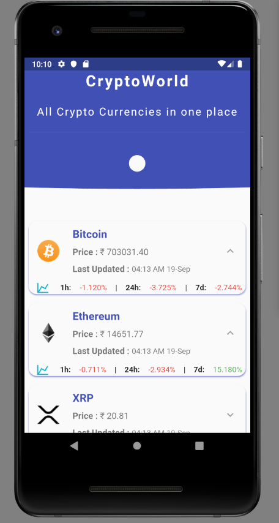
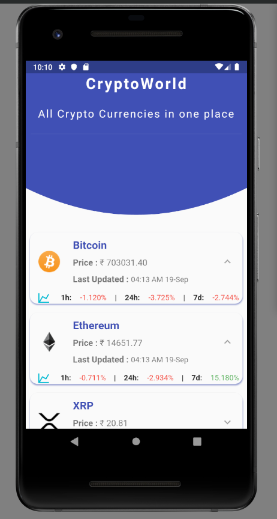
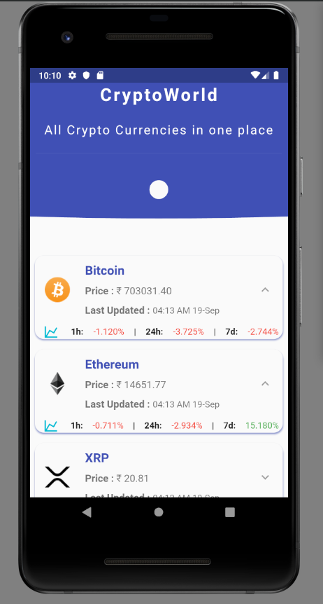
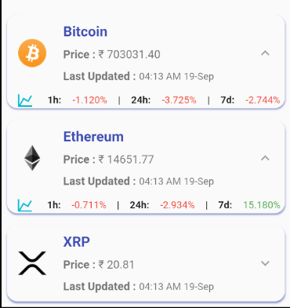

# Flutter Crypto

A Flutter based application that fetches the most recent available data available for CryptoCurrencies from [CoinMarketCap](https://coinmarketcap.com/api/) API.
The application uses [Provider](https://pub.dev/packages/provider) for state-management and has some different widgets from [groovin](https://pub.dev/packages?q=groovin) package.

This source code will help new flutter devs in understanding how to parse complex API response data and mapping it using state management.

## Screenshots
   

  
